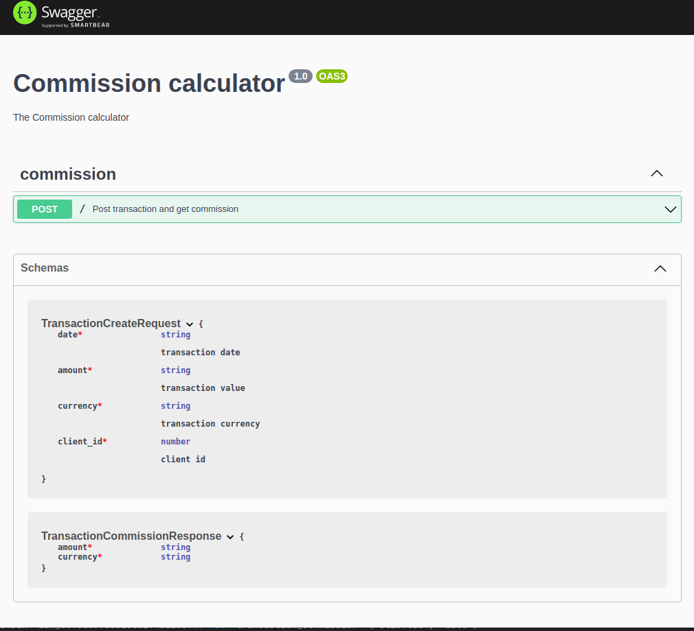

# Commission calculator

Rest api for transaction processing and commission calculation, written in nest.js

# Setup

* Copy/rename `env.example` file to `.env`
* Copy/rename & configure `docker-compose.override.yml.example` file to `docker-compose.override.yml`
* Run `docker-compose up -d`
* Run `docker-compose restart`
* Run `docker-compose exec commission-service npm run migration:run`

# API
* `POST /` - transaction processing and commission calculation EP

# Swagger 
* http://localhost/api
  

# Tests:
* Run `docker-compose exec commission-service npm run test`
* Run `docker-compose exec commission-service npm run test:e2e`

## Core libs

### Usage of Big (floating point problems)
To solve the issue of floating point arithmetics, all numbers are converted into instances of `Big`, and all mathematics operations
are done by Big API.

## Known problems
* API will accept the request with a monetary value that has more than two decimal places, and the validation strategy of money input is not clear.
But at the end of the day, cryptocurrencies will likely be introduced to the project sooner rather than later, and then the high precision input will be necessary.
* rounding strategy should be implemented explicitly, for now, I've left it on the default mode, but in the real world it is a
business decision and should be clearly defined in the specification of the system.

## Unsolved due to time limitation
* more unit testing could be done
* e2e/integration test could be improved, especially 3rd party error handling should be tested
* e2e testing should use separated database

## Development time
* around 8h-12h
